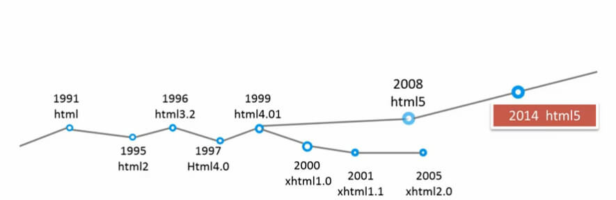
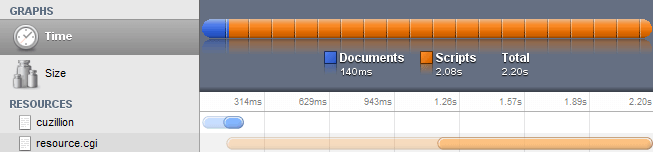
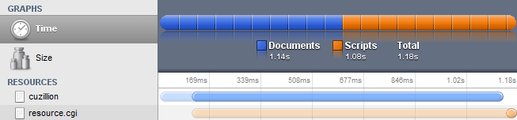
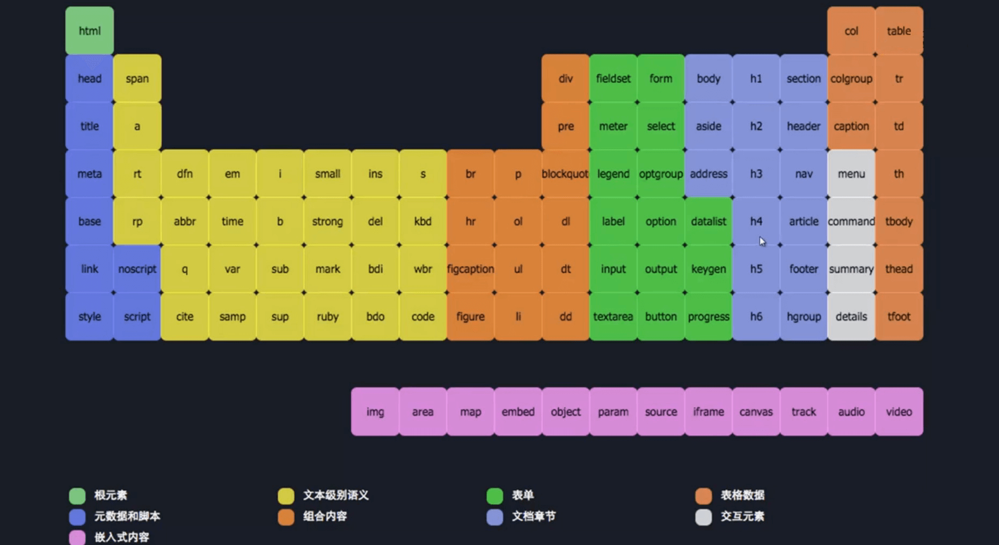

# HTML 结构 

## 介绍

html的结构主要分为`文档声明`、`网页头部信息`、`网页的骨架结构`、`块级元素`、`内联元素`、`结构元素`、`交互元素`、`标签内容模型`等几个主要部分。


## 文档声明

  HTML文档通常以类型声明开始，该声明将帮助浏览器确定其尝试解析和显示的HTML文档类型。下面将详细介绍文档声明DOCTYPE。


### 特性

文档声明要放在代码的第一行、必须定格显示、大小写并不敏感。

> 如果有代码或者其他的东西放在声明的前面，会另ie9-触发怪异模式。

由于文档类型声明不是标签，因此不应具有关闭标签

**版本更迭**

| 版本      | 年份 |
| --------- | ---- |
| HTML      | 1991 |
| HTML+     | 1993 |
| HTML 2.0  | 1995 |
| HTML 3.2  | 1996 |
| HTML 4.01 | 1999 |
| XHTML 1.0 | 2000 |
| HTML5     | 2014 |




### html5声明

```html
<!DOCTYPE html>
```

在HTML5之前，文档声明一般有三种类型：严格型strict、过渡型transitional、框架frameset

严格型DTD包含所有HTML元素和属性，但不包含展示性的和弃用的元素(如font)；而过渡型或宽松型(loose)则包含展示性和启用的元素.

**HTML4.01**

```html
<!DOCTYPE HTML PUBLIC "-//W3C//DTD HTML 4.01//EN"
"http://www.w3.org/TR/html4/strict.dtd">        
<!DOCTYPE HTML PUBLIC "-//W3C//DTD HTML 4.01 Transitional//EN" "http://www.w3.org/TR/html4/loose.dtd">
<!DOCTYPE HTML PUBLIC "-//W3C//DTD HTML 4.01 Frameset//EN" "http://www.w3.org/TR/html4/frameset.dtd">　
```

**XHTML1.0**

```html
<!DOCTYPE html PUBLIC "-//W3C//DTD XHTML 1.0 Strict//EN" "http://www.w3.org/TR/xhtml1/DTD/xhtml1-strict.dtd">        
<!DOCTYPE html PUBLIC "-//W3C//DTD XHTML 1.0 Transitional//EN" "http://www.w3.org/TR/xhtml1/DTD/xhtml1-transitional.dtd">
<!DOCTYPE html PUBLIC "-//W3C//DTD XHTML 1.0 Frameset//EN"  "http://www.w3.org/TR/xhtml1/DTD/xhtml1-frameset.dtd">
```

**XHTML1.1 等同于XHTML1.0 Strict**

```html
<!DOCTYPE html PUBLIC "-//W3C//DTD XHTML 1.1//EN" "http://www.w3.org/TR/xhtml11/DTD/xhtml11.dtd">    
```


## DTD

DTD称为文档类型定义，它可以定义合法的XML文档构建模块，它使用一系列合法的元素来定义文档的结构。在HTML中，DTD使用XML定义了HTML标签规范

  由于HTML5不基于SGML，所以不需要引用DTD。但是需要doctype来启用标准模式(后面的渲染模式会介绍)。HTML5的语法元素来自SGML、HTML、XHTML1.X，使它成为一种有自己规则的合成语言

  HTML、XML和SGML这三者的关系并不容易区分。HTML是SGML的一个实例，它的DTD作为标准被固定下来，因此，HTML不能作为定义其它置标语言的元语言。XML是SGML的一个子集，严格地讲，XML也还是SGML。与HTML不同的是，XML有DTD，因而也可以像SGML那样作为元语言，来定义其它文件系统或置标语言。如果把置标语言分为元置标语言和实例置标语言的话，SGML和XML都是元置标语言，而HTML和由XML派生的XHTML都是实例置标语言。


## 渲染模式

在很久以前的网络上，页面通常有两种版本：为网景(Netscape)的Navigator准备的版本以及为微软(Microsoft)的Internet Explorer准备的版本。当W3C创立网络标准后，为了不破坏当时既有的网站，浏览器不能直接起用这些标准。因此，浏览器采用了两种模式，用以把能符合新规范的网站和老旧网站区分开。

  浏览器排版引擎有三种模式：怪异模式(Quirks mode)、接近标准模式(Almost standards mode)以及标准模式(Standards mode)。在怪异模式下，排版会模拟Navigator4与Internet Explorer 5的非标准行为。为了支持在网络标准被广泛采用前，就已经建好的网站，这么做是必要的。在标准模式下，行为即由HTML与CSS的规范描述的行为。在接近标准模式下，只有少数的怪异行为被实现

  对HTML文档来说，浏览器使用文档开头的DOCTYPE来决定用怪异模式处理或标准模式处理。如果文档中没有DOCTYPE将触发文档的怪异模式。怪异模式最明显的影响是会触发怪异盒模型。在CSS中盒模型被分为两种，第一种是W3C的标准模型，第二种是怪异盒模型。不同之处在于怪异盒模型的宽高定义的是可见元素框的尺寸，而不是元素框的内容区尺寸。


## 文档头部

在声明文档类型之后，HTML文档的下一部分为`<html>`标签，告知浏览器应将括在`<html>`...`</html>`内的所有内容解析为HTML。然后是HTML文档的两个主要部分：`<head>`和`<body>`。`<head>`将包含有关页面的常规信息和元数据，下面将详细介绍HTML的文档头部`<head>`

 

### 概述

  `<head>`大部分不可见，描述了文档的一些基本的属性和信息(可以呈现的是title和icon)。`<head>`元素下的子元素主要包括`<meta>`、`<title>`、`<base>`、`<link>`、`<style>`和`<script>`这六个元素

 

### meta

  <meta>标签(meta-information)用于提供页面有关的元数据，除了提供文档字符集、使用语言、作者等基本信息外，还涉及对关键词和网页等级的设定。通过设置不同的属性，元数据可以分为以下几种:

  如果设置了charset，即将对网页使用的字符集作出声明HTML5

  如果设置了name，它是一个文档级的元数据，将附着在整个页面上

  如果设置了http-equiv，它是一个编译指令，即由服务器提供的来指示页面应如何加载

  如果设置了itemprop，将定义一个用户自定义的元数据(未实现)

**1、charset**

  charset声明声明当前文档所使用的字符编码，但该声明可以被任何一个元素的lang特性的值覆盖。文档的编码一定要与文件本身的编码保持一致，否则会出现乱码，推荐使用UTF-8编码

  注意：字符编码必须写在`<head>`元素的最开始，如果位于`<title>`标签之后，那么`<title>`标签很可能会乱码

```
<meta charset="utf-8"/>
```

**2、name**

【关键词】

```
<meta name="keywords" content="HTML, CSS, XML" />
```

【描述】

```
<meta name="description" content="Free Web tutorials on HTML, CSS, JavaScript" />
```

【作者】

```
<meta name="author" content="littlematch">
```

【版权】

```
<meta name="copyright" content="本页版权归小火柴所有">
```

【视口(移动端使用)】　

```
<meta name="viewport" content="width=device-width, initial-scale=1.0, maximum-scale=1.0, minimum-scale=1.0, user-scalable=no" />
```

【IE浏览器渲染】

```
<meta http-equiv="X-UA-Compatible" content="IE=edge,chrome=1" />
```

  如果安装了GCF(Google Chrome Frame谷歌内嵌浏览器框架GCF)，则使用GCF来渲染页面，如果没有安装，则使用最高版本的IE内核进行渲染

【双核浏览器渲染】

```
<meta name="renderer" content="webkit">
```

  如果是双核浏览器，则使用webkit内核渲染

**3、http-equiv**

【定时跳转】

  让网页多少秒刷新，或跳转到其他网页

```
<meta http-equiv="refresh" content="5">
<meta http-equiv="refresh" content="5;url=http://www.baidu.com">
```

【缓存过期时间】

  可以用于设定网页的到期时间，一旦过期则必须到服务器上重新调用。需要注意的是必须使用GMT时间格式

```
<meta http-equiv="Expires" Content="0">
<meta http-equiv="Expires" Content="Sat Nov 28 2016 21:19:15 GMT+0800">
```

【禁止缓存】

  用于设定禁止浏览器从本地机的缓存中调阅页面内容，用户无法脱机浏览

```
<meta http-equiv="Pragma" Content="No-cach">
```

【独立页面】

  强制页面在当前窗口中以独立页面显示，可以防止自己的网页被别人当作一个frame页调用

```
<meta http-equiv="windows-Target" content="_top">
```

【兼容模式】

  Edge模式告诉IE以最高级模式渲染文档，也就是说，什么版本IE就用什么版本的标准模式渲染；chrome模式表示强制IE使用Chrome Frame渲染。Google官方提供了对Google Frame插件安装情况的检测，这里直接调用方法即可，如果检测到IE并未安装Google Frame，则弹出对话框提示安装。使用此插件，用户可以通过IE的用户界面，以Chrome内核的渲染方式浏览网页

  下面表示如果当前浏览器版本是小于等于IE8的，则使用chrome，如果不是，则使用IE标准模式

```
<meta http-equiv="X-UA-Compatible" content="IE=Edge,chrome=IE8">
```

  注意：关于`<meta>`元素的更多信息[移步至此](https://developer.mozilla.org/zh-CN/docs/Web/HTML/Element/meta)

 

### title

  `<title>`元素定义文档的标题，显示在浏览器的标题栏或标签页上。它只可以包含文本，若是包含有标签，则包含的任何标签都不会被解释

  `<title>`元素详细来说，有以下三个作用：1、定义浏览器工具栏中的标题；2、提供页面被添加到收藏夹时显示的标题；3、显示在搜索引擎结果中的页面标题

  注意：在所有HTML文档中，`<title>`都是必须的

```
<title>About Me</title>
```

 

### base

  `<base>`用于指定文档里所有相对URL地址的基础URL，为页面上所有链接规定默认地址和默认打开方式。文档中的基础URL可以使用document.baseURI进行查询

  注意：一份文档最多一个`<base>`元素。如果指定了多个`<base`>`元素，只会使用第一个href和target值，其余都会被忽略

```
<base href="http://cnblogs.com" target="_blank">
```

 

### link

  `<link>`指定了外部资源与当前文档的关系，具有属性href、rel、media、hreflang、type和sizes。其中href和rel是常用的，href指定了链接的资源的地址(url)，而rel指定了资源的类型

【rel属性】

```
alternate   指示链接到该文档的另一个版本
author      指示链接到当前文档的作者主页
help        指向一个跟网站或页面相关的帮助文档
icon        引入代表当前文档的图标，新的sized属性与这个属性结合使用，指定链接图片的宽高
license     链接到当前的文档的版权声明
next        指示链接到文档是一组文档中的下一份
pingback    处理当前文档被引用情况的服务器地址
prefetch    指明需要缓存的目标资源
prev        标明了上一个文档
search      链接到可以用于搜索当前页面和相关页面的资源
sidebar     链接到可以作为附属上下文的文档
stylesheet  引入样式表
tag         创建应用于当前文档的标签
```

【media属性】

```
screen      计算机屏幕
tty         终端
tv          电视
projection  投影仪
handheld    手持设备
print       打印的页面
braille     盲文设备
aural       语音合成器
all         所有 
```

【sizes属性】

  sizes属性规定被链接资源的尺寸，且只有当被链接资源是图标时，才可使用该属性

```
<link rel="icon" href="demo.gif" type="image/gif" sizes="16x16" />  
```

【引入图标】

```
<link rel="shortcut icon" href="ico.ico"/>    
```

【引入外部样式表】

```
<link rel="stylesheet" type="text/css" href="mystyle.css" />
```

  注意：关于`<link>`元素的更多信息[移步至此](https://developer.mozilla.org/zh-CN/docs/Web/HTML/Element/link)

 

### style

  <style>元素包含了文档的样式化信息或者文档的一部分，常用于引入内部CSS样式

```
<style>
    body{background-color: red;}
</style>
```

  <style>主要包含以下属性

【type】

  该属性以MIME类型(不应该指定字符集)定义样式语言。如果该属性未指定，则默认为‘text/css'

【media】

  指定哪个媒体应该应用该样式

【title】

  指定可选的样式表

【disabled】

  如果指定该属性，关闭(不应用)样式规则到文档中的元素。

【scoped】

  使用scoped属性，可以在页面任意位置添加CSS样式。但是这样就违背了结构与样式分离的原则，要小心使用。如果该属性存在，则样式应用于其父元素；如果不存在，则应用于整个文档。该属性只有chrome和firefox支持

```
<article>
  <div>The scoped attribute</div>
  <p>This text should be black</p>
  <section>
    <style scoped>
      p { color: red; }
    </style>
    <p>This should be red.</p>
  </section>
</article>
```

 

### script

  <script>的作用是在HTML或XHTML文档中嵌入或引用可执行的脚本。没有async或defer属性的脚本和内联脚本会在浏览器继续解析剩余文档前被获取并立刻执行

【src】

  这个属性定义引用外部脚本的URI，这可以用来代替直接在文档中嵌入脚本。有src属性的script元素标签内不应该再有嵌入的脚本

【type】

  该属性定义script元素包含或src引用的脚本语言。属性的值为MIME类型，支持的MIME类型包括text/javascript, text/ecmascript, application/javascript和application/ecmascript。如果没有定义这个属性，脚本会被视作JavaScript。如果MIME类型不是JavaScript类型(上述支持的类型)，则该元素所包含的内容会被当作数据块而不会被浏览器执行

  如果type属性为module，代码会被当作JavaScript模块

```
<!-- HTML4 and (x)HTML -->
<script type="text/javascript" src="javascript.js">

<!-- HTML5 -->
<script src="javascript.js"></script>
```

【defer】

  这个布尔属性定义该脚本是否会延迟到文档解析完毕后才执行

【async】

  async属性是HTML5新增的属性，IE9-浏览器不支持。该布尔属性指示浏览器是否在允许的情况下异步执行该脚本。该属性对于内联脚本无作用(即没有src属性的脚本）

**javascript加载**

  正常情况下，当浏览器在解析HTML源文件时如果遇到外部的script，那么解析过程会暂停，并发送请求来下载script文件，只有script完全下载并执行后才会继续执行DOM解析

```
<script src="myBlockingScript.js"></script>
```

  在下载过程中浏览器是被阻止做其他有用的工作的，包括解析HTML，执行其他脚本，以及展示CSS布局。虽然Webkit预加载扫描程序可以探测性地在下载阶段进行多线程下载，但是某些页面仍然存在很大的网络延迟

  当前有很多技术来提升页面显示速度，但都需要额外的代码以及针对特定浏览器的技巧。现在，script可以通过添加async或者defer属性来让脚本不必同步执行

```
<script async src="myAsyncScript.js" onload="myInit()"></script>  
<script defer src="myDeferScript.js" onload="myInit()"></script>  
```

  async和defer标注的script都不会暂停HTML解析就立刻被下载，两者都支持onload事件回调来解决需要该脚本来执行的初始化

  两者的区别在于执行时的不同：async脚本在script文件下载完成后会立即执行，并且其执行时间一定在window的load事件触发之前。这意味着多个async脚本很可能不会按其在页面中的出现次序顺序执行；与此相对，浏览器确保多个defer脚本按其在HTML页面中的出现顺序依次执行，且执行时机为DOM解析完成后，document的DOMContentLoaded事件触发之前

  注意：如果同时设置async和defer，和只设置async属性的效果一致

  下面展示的是一个需要1秒来下载，以及1秒来解析执行其他操作的例子，整个页面载入花了大约2秒钟



  同样的例子，但这次我们指定了script的defer属性.因为当defer脚本下载的时候，其他操作可以并行执行，所以大概快了1倍



## html骨架结构

一个完整的HTML文档必须包含3个部分：文档声明、文档头部和文档主体。而正是它们构成了HTML的骨架结构。前面已经分别介绍过文档声明和文档头部，下面将详细介绍构成HTML骨架结构的基础元素。

### HTML

`<html>`元素代表HTML文档的根(root)，其他所有元素都是该元素的后代。`<html>`与`</html>`标签限定了文档的开始点和结束点，在它们之间是文档的头部和主体。文档的头部由`<head>`标签定义，而主体由`<body>`标签定义。

【xmlns】

  xmlns属性用于指派文档的XML命名空间。预设值是"[http://www.w3.org/1999/xhtml"，这在XHTML中是必要的，而在HTML中则是可选的](http://www.w3.org/1999/xhtml%22%EF%BC%8C%E8%BF%99%E5%9C%A8XHTML%E4%B8%AD%E6%98%AF%E5%BF%85%E8%A6%81%E7%9A%84%EF%BC%8C%E8%80%8C%E5%9C%A8HTML%E4%B8%AD%E5%88%99%E6%98%AF%E5%8F%AF%E9%80%89%E7%9A%84)

```
<html xmlns="http://www.w3.org/1999/xhtml">
```

### HEAD

  `<head>`标签用于定义文档的头部，它是所有头部元素的容器。`<head>`大部分不可见，描述了文档的一些基本的属性和信息(可以呈现的是title和icon)。`<head>`元素下的子元素主要包括`<meta>`、`<title>`、`<base>`、`<link>`、`<style>`和`<script>`这六个元素

  `<title>`定义文档的标题，它是head部分中唯一必需的元素

  如果在文档中忽略了`<head>`标签，则大部分浏览器会自动创建一个`<head>`元素

 

 

### BODY

  `<body>`表示的是HTML文档的主体内容，任何一个HTML文档，只允许存在一个`<body>`元素

【默认样式】

```
chrome/firefox/safari/IE8+
    margin:8px;
IE7-
    margin:15px 10px;
```

 

### 结构

  在sublime编辑器中，输入!，再按住Tab键，就可以生成一个基本的HTML结构，结构如下

```html
<!DOCTYPE html>
<html>
<head>
  <meta charset="UTF-8">
  <title>Document</title>
</head>
<body>
</body>
</html>  
```

  在实际中，文档的头部结构常常需要承载一些常用的功能，所以HTML结构较复杂，结构如下

```html
<!DOCTYPE html>
<html>
<head>
  <meta charset="utf-8"/>
  <title>Document</title>
  <meta name="keywords" content=""/>
  <meta name="description" content=""/>
  <meta name="viewport" content="width=device-width"/>
  <link rel="stylesheet" href="5/style.css"/>
  <link rel="shortcut icon" href="ico.ico"/>
</head>
<body>
</body>
</html> 
```

## 块级元素

在HTML5出现之前，人们一般把元素分为块级、内联和内联块元素。下面将详细介绍HTML块级元素

。

### h

  标题(Heading)元素有六个不同的级别，`<h1>`是最高级的，而`<h6>`则是最低的。一个标题元素能简要描述该节的主题

  从`<h1>`到`<h6>`，重要性逐渐减小，字体大小也逐渐减小。在使用标题元素时，要注意以下几点

  1、不要为了减小标题的字体而使用低级别的标题，而是使用CSS的font-size样式

  2、避免跳过某级标题：始终要从`<h1>`开始，接下来使用`<h2>` 等等

  3、使用`<section>` 元素时，为了方便起见，避免重复在一个页面上使用`<h1>`，`<h1>`应该用来表示页面的标题，其他的标题当从`<h2>`开始。使用`<section>`时，应当每个 section都使用一个`<h2>`

【默认样式】

```html
//从h1到h6
margin: 0.67em 0 -> 0.83em 0 -> 1em 0 -> 1.33em 0 -> 1.67em 0 -> 2.33em 0;
font-size: 2em -> 1.5em -> 1.17em -> 1em -> 0.83em -> 0.67em;
font-weight: bold;
```

HTML5新增了`<hgroup>`标签，它表示标题组，用于组合标题，只在区块需要有多个级别的标题时使用　

```html
<hgroup>
    <h1>水果</h1>
    <h2>苹果</h2>
</hgroup>
```

### p

  <p>元素(paragraph)表示文本的一个段落，该元素通常表现为一整块与相邻文本分离的文本，或以垂直的空白隔离或以首行缩进

【默认样式】

```html
margin: 16px 0;

<p>段落1</p>
<p>段落2</p>
<p>段落3</p>
```

### div

  <div>元素(divide)(或HTML文档分区元素)是一个通用型的流内容容器，它在语义上不代表任何特定类型的内容，它可以被用来对其它元素进行分组，一般用于样式化相关的需求(使用class或id特性)或者对具有相同特性的一组元素进行分组(比如lang)，它应该在没有任何其它语义元素可用时才使用(比如<article>或<nav>)


### hr

  `<hr>`元素表示段落级元素之间的主题转换(例如，一个故事中的场景的改变，或一个章节的主题的改变)。在HTML的早期版本中，它是一个水平线。现在它仍能在可视化浏览器中表现为水平线，但目前被定义为语义上的，而不是表现层面上

  `<hr>`用于段落级元素之间的分割，区块之间不需要使用`<hr>`进行分割

```html
<p>段落1</p>
<hr>
<p>段落2</p>
```

【默认样式】

```css
margin: 8px 0;
border-style: inset;
border-width: 1px;
```

### pre

`<pre>`元素表示预定义格式文本。在该元素中的文本通常按照原文件中的编排，以等宽字体的形式展现出来，文本中的空白符(比如空格和换行符)都会显示出来，通常表示已排版的内容，如代码块和字符画等


```html
<pre>
body {
  color:red;
}
</pre>
```

【默认样式】

```css
margin: 1em 0;
white-space: pre;
```

### blockquote

  `<blockquote>`元素(或者HTML块级引用元素)，代表其中的文字是引用内容。通常在渲染时，这部分的内容会有一定的缩进。若引文来源于网络，则可以将原内容的出处URL地址设置到cite特性上，若要以文本的形式告知读者引文的出处时，可以通过`<cite>`元素

  [注意]引用的署名必须在引用外部定义

```html
<blockquote cite="http://baike.baidu.com/view/921793.htm">
　　<p>横眉冷对千夫指,俯首甘为孺子牛</p>
</blockquote>    
<p>鲁迅</p>
```

【默认样式】

```
margin: 1em  40px;
```

### address

  `<address>`元素可以让作者为它最近的`<article>`或者`<body>`祖先元素提供联系信息。在后一种情况下，它应用于整个文档

  当表示一个和联系信息无关的任意的地址时，使用`<p>`元素而不是`<address>`元素。这个元素不能包含除了联系信息之外的任何信息，比如出版日期(这应该包含在`<time>`元素中)。通常，`<address>`元素可以放在当前section的`<footer>`元素中，如果存在的话

【默认样式】

```
font-style: italic;
```

### 其他

  除了上面介绍的`<div>`、`<h>`、`<p>`、`<hr>`、`<blockquote>`、`<address>`标签外，还有一些标签属于块级标签

  包括骨架类标签(`<html>`、`<body>`)，列表类标签(`<ul>`、`<ol>`、`<dl>`、`<dd>`、`<dt>`)，表单类标签(`form`、`<fieldset>`、`<output>`、`<legend>`、`<optgroup>`、`<option>`)，HTML5新增的结构标签(`<article>`、`<aside>`、`<header>`、`<footer>`、`<nav>`、`<section>`)，HTML5新增的多媒体标签(`<figure>`、`<figcaption>`)，HTML5新增的功能性标签(`<summary>`、`<details>`)

 

## Tip：

  可能有人会觉得`<br>`标签应该是一个块级元素，因为它有换行，与块级元素的特征很相似。但它实际上是一个内联元素，它的用途是在文本中产生一个换行


## 内联元素

  用于标记段落里的文本和其他内容组的元素种类很多，下面将这些文本级元素进行简单分类，便于整理和记忆

 

### 通用容器

  `<span>`元素是短语内容的通用行内容器，并没有任何特殊语义。可以使用它来编组元素以达到某种样式意图(通过使用类或者Id属性)，或者这些元素有着共同的属性，比如`lang`。应该在没有其他合适的语义元素时才使用它。`<span>`与`<div>`元素很相似，但`<div>`是一个块元素而则是行内元素

```
<p>Some <span>text</span></p>
```

 

### 强调重要

  虽然浏览器通常用斜体和粗体来显示`em`和`strong`，但这些元素不应用作加粗和斜体。这两个元素分别用来提升包含内容的强调程度和重要性

`<em>`  表示强调，`<em>`元素是可以嵌套的，嵌套层次越深，则其包含的内容被认定为越需要着重阅读

`<strong>`  表示重要

```
<p>I am <em>very</em> worried!</p>
<strong>warning</strong>
```

 

### 文字间隔

  `i`和`b`元素历来是用来展示粗体和斜体字体的，但在HTML5中，它们有了新的语义

```
<i>
```

  1、表示不同情绪或声音的文本，如内心对白

```
<p>Simon smirked,"Yes,I'm happy to take the garbage out." <i>Ugh,I <em>really</em> don't want to !</i> he thought as he picked up the garbage bag.</p>
```

  2、表示外来语、分类学名和技术术语等

```
<i lang="fr">Oh la la!</i>
```

 

```
<b>
```

  1、用于分隔文字

```
<p>After bringing <b>water</b> to a boil, add <b>potatoes</b> and <b>carrots</b></p>
```

  2、用于文章或故事的引言

```
<p><b class="lede">Meteorologists predict more sunshine and scorching temperatures for the upcoming week, prompting area farmers to install irrigation systems.</b></p>
```

 

### 不精确文字

`<s>`  在HTML5中重新定义为有错的、过时的、不被建议使用的文本，常用于表示价格变动等

```
<p>价格<s>￥1298</s>￥998！</p>
<p><s>37度</s> <strong>41度</strong></p>    
```

 

### 高亮显示

`<mark>`  表示高亮或用于引用而标记的文字

```
<p><mark>We're all hoping it rains soon</mark>, some farmers have installed irrigation systems, at <em>considerable</em> expense</p>
```

 

### 次要评论

`<small>`  表示旁注，可用于免责声明、使用条款和版权信息等需要小字体的场景

```
<small>图片仅供参考，请以实物为准</small>
<small>Chris Elhorn | The city Press</small>
```

 

### 术语处理

`<dfn>`  用来定义术语

```
<p>The term <dfn>organic food</dfn> refers to food produced without synthetic chemicals</p>
```

 

`<abbr>`  缩写词，可以配合`<dfn>`定义术语

```
<p>The <dfn><abbr title="Garage Door Operner">GDO</abbr></dfn> id a device allows off-world teams to open the iris.</p>
```

 

### 引用

`<cite>`  表示作品标题的引用，可以是书影音画等

```
<p>我最喜欢的电影是<cite>千与千寻</cite></p>
```

 

`<q>`  表示短引用，常用于引用别人说的话，用引号可以表达等价语义

```
<p>The judge said <q>You can drink water form the fish tank</q> but advised against it.</p>
```

 

### 换行

`<br>`  换行

  注意：`<br>`标签是文本级语义元素，可以设置行高和字体大小，但设置宽高无效

```
<p>
    <b>The City Press</b><br />
    123 General Street <br />
    Springfield, OH 45501
</p>
```

`<wbr>`  需要时指定单词可以换行的位置

```
<i>Irrigation<wbr /> Direct</i>
```

 

### 上标下标

  这两个标签在数学等式、科学符号和化学公式中非常有用

`<sup>`  表示上标

```
<p>
    a<sup>2</sup>
    +
    b<sup>2</sup>
    =
    c<sup>2</sup>
</p>
```

 

`<sub>`  表示下标

```
<p>
    H<sub>2</sub>
    SO<sub>4</sub>
</p>
```

 

### 文本删改

  如果要表示文档的增删改记录，则应该使用ins和del标签

`<ins>`  文档中插入的内容

`<del>`  文档中删除的内容

  注意：`<ins>`和`<del>`可以嵌套任何元素

【属性】

  1、`datetime`:用于标明编辑的日期和可选的时间

  2、`cite`:用于指定说明编辑的文档网址

```
<p>一打有 <del datetime="2015-12-30T00:00Z" cite="edit.html">二十</del> <ins>十二</ins> 件。</p>
```

 

### 特定时间

`<time>`  表示日期或时间

【属性】

  1、`datatime`表示确切的时间，遵循格式YYYY-MM-DDThh:mm:ssTZD，表示年-月-天-分割符T-时-分-秒-时区

  2、`pubdate`表示`<time>`元素中的日期或时间是文档的发布日期

```
<p>我们在每天早上 <time>9:00</time> 开始营业。</p>
<p>我在<time datetime="2008-02-14">情人节</time>有个约会。</p>
<small>Posted <time datetime="2015-12-30T00:00:00UTC+08:00"></time></small>
```

 

### 注音标识

  `ruby`标签定义注音标识，多用于CJK文字，CJK是指中日韩统一表意文字(Chinese、Japanese、Korean)

`<ruby>`  表示ruby标记

`<rt>`  表示ruby标记文字

`<rp>`  表示ruby标记括号

```
<ruby>
 漢 <rt> ㄏㄢˋ </rt>
</ruby>
<ruby>
  汉
  <rp>(</rp>
  <rt>hàn</rt>
  <rp>)</rp>
  语
  <rp>(</rp>
  <rt>yǔ</rt>
  <rp>)</rp>    
</ruby>
```

 

### 文字方向

`<bdi>`  忽略周围文字方向的文字

`<bdo>`  覆盖两种方向的设置，允许显式设置方向，并覆盖所有其他当前方向

```
<p>When rendered by a browser, <bdo dir="rtl">these words</bdo> will appear as 'sdroweseht'</p>
```

 

### 代码

`<code>`  表示计算机代码

`<kbd>`  定义键盘码

`<samp>`  定义计算机例子代码

`<tt>`  定义打字机代码

`<var>`  定义变量

```
<p>
  <code>Computer code</code>
  <br />
  <kbd>Keyboard input</kbd>
  <br />
  <tt>Teletype text</tt>
  <br />
  <samp>Sample text</samp>
  <br />
  <var>Computer variable</var>
  <br />
</p>
```

## html5结构元素

几年前，用于网页布局一般都用div元素，但语义化并不好。HTML5引入了大量新的块级元素来帮助提升网页的语义，使页面具有逻辑性结构、容易维护，并且对数据挖掘服务更友好。下面将详细介绍HTML5结构元素

 

### 概述

  结构元素，又称为区块型元素，是用来定义区块内容范围的元素。之前，区块型元素只有<div>一个，HTML5新增了7个语义化结构元素，包括`<article>、<aside>、<nav>、<section>、<header>、<footer>、<main>`

 

### section

  Section元素(`<section>`)表示文档中的一个区域(或节)，是区块级通用元素。比如，内容中的一个专题组，一般来说会有包含一个标题(heading)。一般通过是否包含一个标题(`<h1>-<h6> `element)作为子节点，来辨识每一个`<section>`

  注意：如果元素内容可以分为几个部分的话，应该使用`<article>`而不是`<section>`；再有，不要把`<section>`元素作为一个普通的容器来使用，这是本应该是`<div>`的用法。 一般来说，一个`<section>`应该出现在文档大纲中

 

### article

  `<article>`元素表示文档、页面、应用或网站中的独立结构，其意在成为可独立分配的或可复用的结构。可能是论坛帖子、杂志或新闻文章、博客、用户提交的评论、交互式组件，或者其他独立的内容项目。当`<article>`元素嵌套使用时，则该元素代表与外层元素有关的文章。例如，代表博客评论的`<article>`元素可嵌套在代表博客文章的`<article>`元素中

  `<article>`元素的作者信息可通过`<address>`元素提供，但是不适用于嵌套的`<article>`元素；`<article>`元素的发布日期和时间可通过`<time>`元素的pubdate属性表示

  注意：对于`<article>`和`<section>`来说，是必须要加上标题的

 

### aside

  `<aside>`元素表示一个和其余页面内容几乎无关的部分，被认为是独立于该内容的一部分并且可以被单独的拆分出来而不会使整体受影响。一般用于表示不直接相关内容的侧边栏，`<aside>`里面的内容与它所关联的内容相互独立，谁缺了谁都不影响各自文本含义的理解。如一篇文章的广告、相关背景和引述内容等

 

### nav

  HTML导航栏(`<nav>`)描绘一个含有多个超链接的区域，这个区域包含转到其他页面，或者页面内部其他部分的链接列表

  并不是所有的链接都必须使用`<nav>`元素，它只用来将一些热门的链接放入导航栏，例如`<footer>`元素就常用来在页面底部包含一个不常用到，没必要加入`<nav>`的链接列表

  一个网页也可能含有多个`<nav>`元素，例如一个是网站内的导航列表，另一个是本页面内的导航列表

 

### header

  `<header>`元素表示页面头部或区块头部，用于将介绍内容和区块的辅助导航分组到一起，所以它有可能包含区块的标题元素以及其他的介绍内容(目录、logo等)

   注意：由于`<header>`和`<footer>`元素不是分节内容，所以不会引入新的分节到大纲中

 

### footer

  `<footer>`元素表示最近一个章节内容或者根节点(sectioning root)元素的页脚。一个页脚通常包含该章节作者、版权数据或者与文档相关的链接等信息

  注意：`<footer>`元素内的作者信息应包含在`<address>`元素中

 

### main

  `<main>`元素放在最后说，是因为`<main>`不常用，最主要的原因是IE浏览器都不支持

  main元素(`<main>`)呈现了文档`<body>`或应用的主体部分。主体部分由与文档直接相关，或者扩展于文档的中心主题、应用的主要功能部分的内容组成。这部分内容在文档中应当是独一无二的，不包含任何在一系列文档中重复的内容

  `<main>`标签不能是以下元素的继承，包括`<article>、<aside>、<footer>、<header>`、或`<nav>`。 在一个文档中不能出现一个以上的 `<main>`标签

  所以，一个正常的最外层布局应该是下面这样

```
<header></header>
<main>
  <section></section>
  <section></section>
  <section></section>
</main>
<footer></footer>
```

  但现在，一般地，布局如下 

```html
<header></header>
<section></section>
<section></section>
<section></section>
<footer></footer>
```

**案例:**

```html
<!DOCTYPE html>
<html lang="en">
<head>
  <meta charset="UTF-8">
  <title>苹果首页</title>
</head>
<body>
<nav>
  <ul>
    <li><a href="#">Apple</a></li>
    <li><a href="#">Mac</a></li>
    <li><a href="#">iPad</a></li>
    <li><a href="#">iPhone</a></li> 
    <li><a href="#">Watch</a></li> 
    <li><a href="#">Music</a></li> 
    <li><a href="#">技术支持</a></li> 
    <li><a href="#">搜索</a></li> 
    <li><a href="#">购物袋</a></li>           
  </ul>
</nav>
<article>
  <section>展示1</section>
  <section>展示2</section>
  <section>展示3</section>
  <section>展示4</section>
  <nav>
    <ul>
      <li>按钮1</li>
      <li>按钮2</li>
      <li>按钮3</li>
      <li>按钮4</li>
    </ul>
  </nav>
</article>
<aside>
  <ul>
    <li><a href="#">Watch</a></li>
    <li><a href="#">Pencil</a></li>
    <li><a href="#">iPad</a></li>
    <li><a href="#">MacBook</a></li>
  </ul>
</aside>
<footer>
  <nav>
    <div>选购及了解</div>
    <div>商店</div>
    <div>应用</div>
    <div>账户</div>
    <div>关于</div>
  </nav>
  <section>
    <div>其他杂项</div>
  </section>
</footer>
</body>
</html>
```

## html标签内容模型

HTML核心的部分莫过于标签(tag)了。标签是用来描述文档中的各自内容基本单元，不同标签表示着不同的含义，标签之间的嵌套表示了内容之间的结构。

HTML标签在HTML5中内容模型拓展到了7类，包括元数据型、区块型、标题型、文档流型、语句型、内嵌型、交互型。但即使是这7个类别也没有完全覆盖所有元素的所有情况，元素可以不属于任何一个类别，被称为穿透的；很多元素可能属于不止一个类别，称为混合的。


 [HTML标签详细信息见此w3c链接](http://dev.w3.org/html5/spec-author-view/index.html#element-content-categories)



